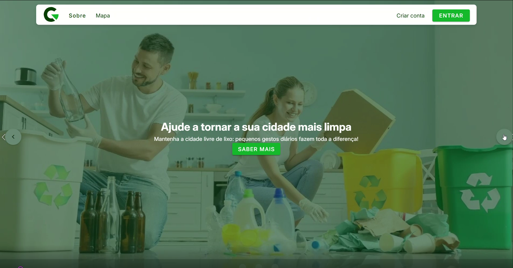
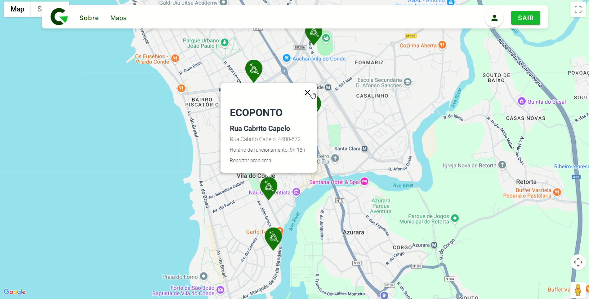
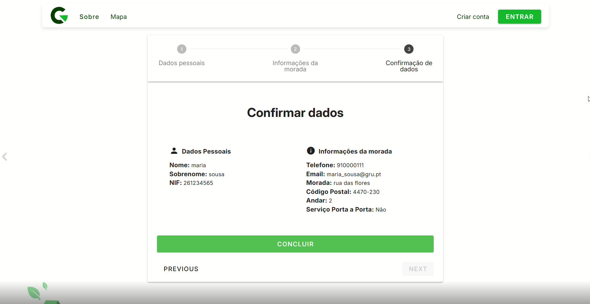
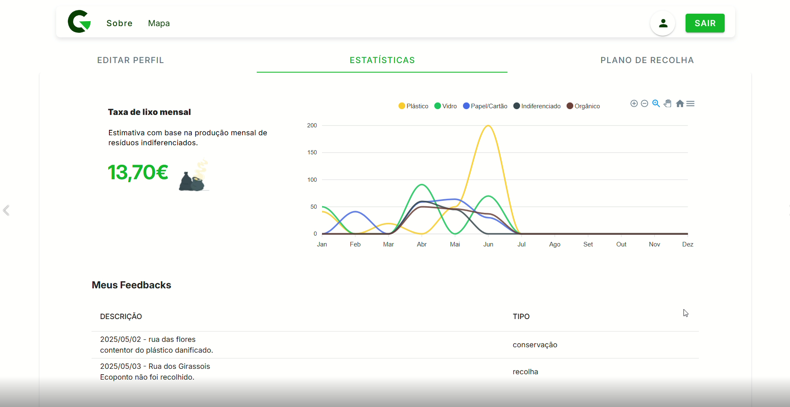
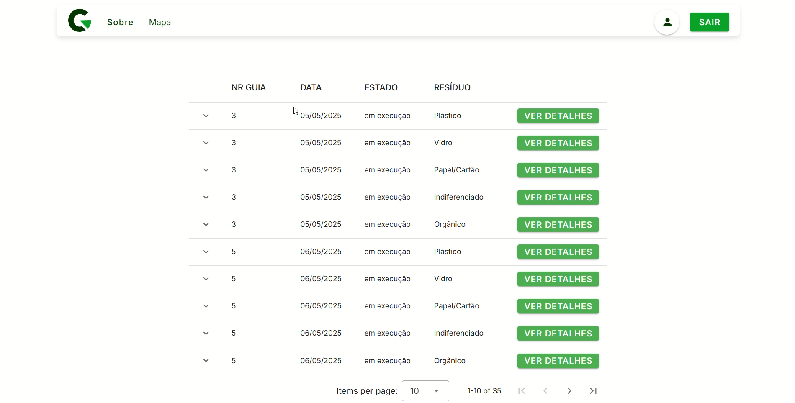
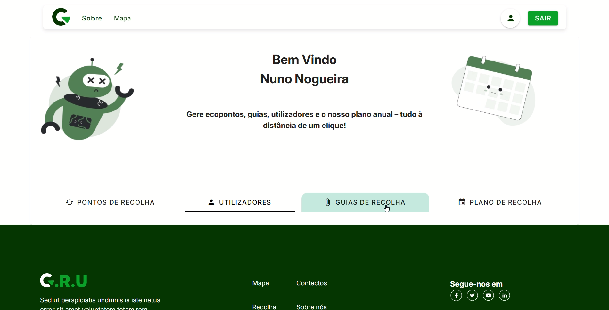

# Smart Waste Management Platform

## 📖 About the Project

The application follows a client-server architecture, with a front-end responsible for the user interface and back-end providing the API and application logic.

The main goal of the project is to develop a web application that consumes and provides APIs, allowing users to interact with the application's functionality through a web-based interface.

## ✨ Features

- user interaction through a web interface;
- communication between the front-end and back-end through APIs;
- Data retrieval and manipulation through HTTP requests;
- Back-end API for handling application functionality;








## 🛠️ Technologies

- **Front-end** - Vue.js & Vuetify;
- **Back-end** - Node.js & Express;
- **Database** - MySQL.

## 🚀 Getting Started

```
git clone https://github.com/nuno-nogueira/smart-waste-platform.git
cd smart-waste-platform
```

### Install dependencies

Install the project dependencies using:

```
npm install
```

### Run the app

The front-end and back-end are located in their respective directories and can be started according to their individual configurations.


## 👥 Team

<table> <tr> <td align="center"> <a href="https://github.com/nuno-nogueira">  <br /> <sub><b>Nuno Nogueira</b></sub> </a> </td>

<td align="center">
  <a href="https://github.com/kenLukau31">
    
    <br />
    <sub><b>Ken Lukau</b></sub>
  </a>
</td>

<td align="center">
  <a href="https://github.com/sandrafmoreira">
    
    <br />
    <sub><b>Sandra Moreira</b></sub>
  </a>
</td>
